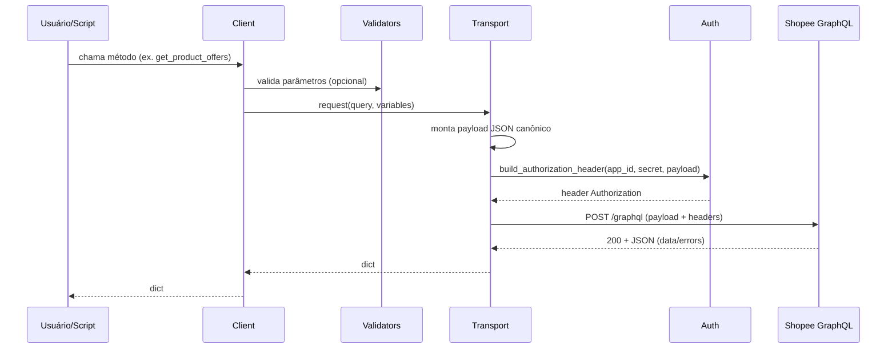

# Arquitetura do Sistema — Shopee Afiliados Docs

Este repositório contém um **cliente Python** (instalável) para a API GraphQL de Afiliados da Shopee BR, além de **scripts** e **documentação** para exploração de schema, validação e exemplos.

## 1) Visão geral (alto nível)

**Objetivo:** facilitar chamadas à API GraphQL da Shopee Affiliate com autenticação por assinatura SHA256, mantendo o projeto **manutenível** e **modular**.

**Camadas principais (runtime):**

- **ShopeeAffiliateClient** (`src/shopee_affiliate/client.py`)
  - API de alto nível: métodos por endpoint (ex.: `get_product_offers`, `generate_short_link`).
- **Validators** (`src/shopee_affiliate/validators.py`)
  - Regras práticas e validações de parâmetros (ex.: `subIds`).
- **Transport** (`src/shopee_affiliate/transport.py`)
  - HTTP POST, timeout, retry/backoff, serialização canônica do payload.
- **Auth** (`src/shopee_affiliate/auth.py`)
  - Geração de assinatura e header `Authorization`.

**Apoio (dev/ops):**

- **Docs** (`docs/`): guias e descobertas do schema.
- **Scripts** (`scripts/`): exploração/introspecção e suíte de integração.
- **Testes**:
  - `tests/unit/`: unit tests (rápidos, sem rede).
  - `tests/python/`: integrações/execuções “manuais” (não coletados pelo pytest).

## 2) Interações entre componentes

### Fluxo típico de uma chamada

1. Usuário chama um método do `ShopeeAffiliateClient`.
2. O client valida parâmetros críticos (quando aplicável) via `validators`.
3. O client monta a query/mutation GraphQL.
4. O client chama `transport.request(query, variables)`.
5. O transport:
   - serializa o payload JSON de forma canônica (`separators=(',', ':')`)
   - cria o header `Authorization` via `auth.build_authorization_header`
   - executa HTTP POST com `timeout`
   - aplica retry/backoff em `429/5xx` (quando configurado)
6. Retorna o JSON (`dict`) exatamente como a API responde (`data`/`errors`).

### Diagrama de componentes (Mermaid)

```mermaid
flowchart LR
  U[Seu código] --> C[ShopeeAffiliateClient]
  C --> V[validators]
  C --> T[transport]
  T --> A[auth]
  T -->|HTTP POST /graphql| API[(Shopee Affiliate GraphQL)]
  API -->|JSON (data/errors)| T --> C --> U
```

## 3) Diagramas de fluxo de dados

### 3.1) Fluxo de dados: requisição GraphQL



### 3.2) Fluxo de dados: assinatura/autenticação

```mermaid
flowchart TD
  P[Payload JSON canônico] --> S[sign_factor = appId + timestamp + payload + secret]
  S --> H[SHA256(sign_factor)]
  H --> AH[Authorization: SHA256 Credential=... Timestamp=... Signature=...]
```

## 4) Decisões de design (e justificativa)

### 4.1) Retornar `dict` (JSON cru) em vez de DTOs
- **Justificativa:** a API pode mudar campos com frequência; retornar JSON cru reduz atrito e evita quebrar o consumidor.
- **Trade-off:** menos segurança de tipos; por isso adicionamos *unit tests* para partes críticas (auth/validators).

### 4.2) Separação em camadas (auth/transport/validators/client)
- **Justificativa:** melhora manutenibilidade e testabilidade.
  - `auth` e `validators` são funções puras → unit tests fáceis.
  - `transport` concentra preocupações de rede (timeout/retry).

### 4.3) Wrapper de compatibilidade (`shopee_affiliate_client.py`)
- **Justificativa:** preservar imports existentes (`from shopee_affiliate_client import ShopeeAffiliateClient`) sem forçar refactor nos consumidores.

### 4.4) Retry/backoff no transport
- **Justificativa:** API pode retornar `429` (rate limit) e erros transitórios `5xx`. Um retry limitado aumenta confiabilidade.
- **Trade-off:** pode aumentar latência; por isso há `max_attempts` pequeno.

### 4.5) Validação “prática” de `subIds`
- **Justificativa:** a API rejeita certos formatos (ex.: underscore) com erro `11001`. Validar cedo dá feedback melhor.
- **Trade-off:** regra pode ser mais restritiva que a documentação; se a Shopee flexibilizar, basta ajustar `validators.py`.

## 5) Restrições e limitações

- **Dependência de schema externo:** campos/estruturas podem mudar; scripts de introspecção ajudam a revalidar.
- **Rate limits e instabilidade de rede:** mitigado com retry/backoff limitado.
- **`scrollId` expira rápido** (documentado pela Shopee): qualquer paginação precisa respeitar janela curta.
- **Sem tipagem forte de resposta:** por escolha deliberada; consumidores devem checar `errors` e navegar em `data`.
- **Testes de integração dependem de credenciais e estado da conta** (ex.: `conversionReport` pode vir vazio).

---

## Referências (no repo)

- Cliente: `src/shopee_affiliate/client.py`
- Queries/Mutations: `src/shopee_affiliate/queries.py`
- Transport: `src/shopee_affiliate/transport.py`
- Auth: `src/shopee_affiliate/auth.py`
- Validators: `src/shopee_affiliate/validators.py`
- Suíte integração: `scripts/run_all_tests.py`
