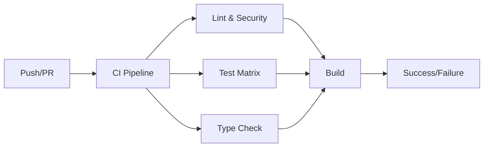
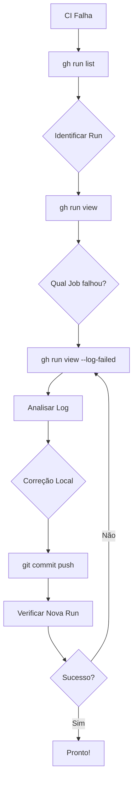

# Guia de Configuração CI/CD - Shopee Affiliate API Client

**Data:** 16/02/2026
**Status:** ✅ CI/CD Configurado e Funcionando

---

## 📋 Índice

1. [Visão Geral](#visão-geral)
2. [Arquivos de Configuração GitHub](#arquivos-de-configuração-github)
3. [Pipeline CI](#pipeline-ci)
4. [Pipeline de Release](#pipeline-de-release)
5. [Solução de Problemas](#solução-de-problemas)
6. [Comandos Úteis](#comandos-úteis)
7. [Badge Reference](#badge-reference)

---

## 🎯 Visão Geral

Este repositório possui uma configuração completa de CI/CD usando GitHub Actions:



### Status Atual

| Componente | Status | Detalhes |
|------------|--------|----------|
| **Lint** | ✅ | ruff check + format |
| **Security** | ✅ | bandit + safety |
| **Tests** | ✅ | Python 3.10, 3.11, 3.12, 3.13 |
| **Type Check** | ✅ | mypy com types-requests |
| **Build** | ✅ | python -m build + twine check |

---

## 📁 Arquivos de Configuração GitHub

### Estrutura Completa

```
.github/
├── workflows/
│   ├── ci.yml              # Pipeline CI principal
│   └── release.yml         # Pipeline de releases
├── CODEOWNERS              # Responsáveis por code review
├── dependabot.yml          # Atualizações automáticas de dependências
├── FUNDING.yml             # Links para doações/sponsors
├── CODE_OF_CONDUCT.md       # Código de conduta (Contributor Covenant 1.4)
├── ISSUE_TEMPLATE/
│   ├── bug_report.md       # Template para reportar bugs
│   ├── feature_request.md  # Template para solicitar features
│   ├── documentation.md    # Template para issues de documentação
│   └── config.yml          # Configuração dos Issue Forms
├── PULL_REQUEST_TEMPLATE.md # Template para Pull Requests
└── ISSU_TEMPLATE/           # Issue Forms YAML (opcional)
```

### Descrição dos Arquivos

#### `.github/workflows/ci.yml`

Pipeline CI completo com 5 jobs:

```yaml
jobs:
  lint:           # Verificação de código com ruff
  security:       # Scan de segurança com bandit + safety
  test:           # Matrix de testes (Python 3.10-3.13)
  type-check:     # Verificação de tipos com mypy
  build:          # Build do pacote + validação com twine
```

#### `.github/workflows/release.yml`

Pipeline automatizado de releases:

```yaml
trigger:
  - tags matching "v*.*.*"  # Ex: v1.0.0, v2.1.3
  - workflow_dispatch       # Disparo manual

steps:
  - Criar release no GitHub
  - Gerar changelog automático
  - Upload opcional para PyPI (via PYPI_API_TOKEN)
```

#### `.github/CODEOWNERS`

Define quem aprova changes em cada parte do código:

```
* @gabrielramos

/docs/ @gabrielramos
/scripts/ @gabrielramos
/tests/ @gabrielramos
```

#### `.github/dependabot.yml`

Configura atualizações automáticas de dependências:

```yaml
updates:
  - package-ecosystem: "pip"
    directory: "/"
    schedule:
      interval: "weekly"
      day: "monday"
      time: "09:00"
    open-pull-requests-limit: 10
```

#### `.github/FUNDING.yml`

Links para patrocínio:

```yaml
github: prof-ramos
custom:
  - https://www.buymeacoffee.com/gabrielramos
```

#### `.github/CODE_OF_CONDUCT.md`

Código de conduta baseado em [Contributor Covenant 1.4](https://www.contributor-covenant.org/version/1/4/code-of-conduct.html):

- Compromissos da comunidade
- Padrões de comportamento
- Comportamento inaceitável
- Responsabilidades dos mantenedores
- Processo de reporte
- Medidas corretivas

---

## 🔄 Pipeline CI

### Jobs do CI

#### 1. Lint (ruff)

Verifica código com ruff:

```bash
ruff check src/ examples/ scripts/ tests/
ruff format --check src/ examples/ scripts/ tests/
```

**Regras configuradas:**
- F841: Variáveis não usadas
- F401: Imports não usados
- E402: Imports fora do topo (com # noqa: E402)
- F541: f-strings sem placeholders
- Invalid syntax

#### 2. Security Scan

Executa verificação de segurança:

```bash
bandit -r src/ -f json -o bandit-report.json
safety check --json
```

**Relatórios:** Upload como artifacts

#### 3. Test Matrix

Executa testes em múltiplas versões do Python:

```yaml
matrix:
  python-version: ['3.10', '3.11', '3.12', '3.13']
```

**Comandos:**

```bash
# Sem credenciais (CI)
pytest tests/ -v --tb=short -m "not integration"

# Com credenciais (local)
pytest tests/ -v --tb=short
```

**Instalação do pacote:**

```bash
pip install -e .           # Instala pacote em modo editável
pip install -r requirements-dev.txt
```

#### 4. Type Check (mypy)

Verificação de tipos estática:

```bash
pip install mypy types-requests
mypy src/ --ignore-missing-imports --no-error-summary
```

**Nota:** `types-python-dotenv` não existe no PyPI (removido).

#### 5. Build Package

Valida o pacote:

```bash
pip install build twine
python -m build
twine check dist/*
```

---

## 🚀 Pipeline de Release

### Gatilhos

- **Automático:** Tags no formato `v*.*.*` (ex: `v1.0.0`)
- **Manual:** GitHub Actions → "Run workflow"

### Processo de Release

```bash
# 1. Criar tag
git tag v1.0.0 -m "Release v1.0.0"
git push origin v1.0.0

# 2. Workflow executa automaticamente:
#    - Cria release no GitHub
#    - Gera changelog
#    - (Opcional) Upload para PyPI
```

### Upload para PyPI (Opcional)

Configure secret `PYPI_API_TOKEN` no repositório:

```yaml
env:
  PYPI_API_TOKEN: ${{ secrets.PYPI_API_TOKEN }}

steps:
  - pip install twine
  - twine upload dist/*
```

---

## 🔧 Solução de Problemas

### Erro 1: types-python-dotenv não existe

**Erro:**
```
ERROR: Could not find a version that satisfies the requirement types-python-dotenv
```

**Solução:** Remover do `requirements-dev.txt` e do CI:

```diff
- types-python-dotenv>=1.0.0
```

```diff
- pip install mypy types-requests types-python-dotenv
+ pip install mypy types-requests
```

### Erro 2: E402 - Module level import not at top of file

**Erro:**
```
E402 Module level import not at top of file
  --> tests/python/test_conversion_report.py:19:1
```

**Causa:** `sys.path.insert()` antes de importar módulo.

**Solução:** Adicionar `# noqa: E402`:

```python
sys.path.insert(0, os.path.join(ROOT, "examples", "python"))

from shopee_affiliate_client import ShopeeAffiliateClient  # noqa: E402
```

### Erro 3: pytest.skip fora de contexto

**Erro:**
```
Using pytest.skip outside of a test will skip the entire module.
```

**Solução:** Usar `pytest.skip()` com `allow_module_level=True`:

```python
if not SHOPEE_APP_ID or not SHOPEE_APP_SECRET:
    import pytest
    pytest.skip(
        "Defina SHOPEE_APP_ID e SHOPEE_APP_SECRET em um .env (veja .env.example)",
        allow_module_level=True
    )
```

### Erro 4: ModuleNotFoundError: No module named 'shopee_affiliate'

**Erro:**
```
ModuleNotFoundError: No module named 'shopee_affiliate'
```

**Causa:** Testes unitários importam o módulo diretamente.

**Solução:** Instalar pacote em modo editável no CI:

```yaml
- name: Install dependencies
  run: |
    python -m pip install --upgrade pip
    pip install -e .          # ← Adicionar esta linha
    pip install -r requirements-dev.txt
```

### Erro 5: F541 - f-string without any placeholders

**Erro:**
```
F541 [*] f-string without any placeholders
  --> tests/python/test_conversion_report.py:40:11
    |
 40 |     print(f"(últimos 30 dias)")
    |           ^^^^^^^^^^^^^^^^^^^^
```

**Solução:** Remover prefixo `f` de strings sem placeholders:

```diff
- print(f"(últimos 30 dias)")
+ print("(últimos 30 dias)")
```

**Correção em lote:**

```bash
ruff check tests/ --fix
ruff format tests/
```

### Erro 6: SyntaxError - positional argument follows keyword argument

**Erro:**
```
SyntaxError: positional argument follows keyword argument
    )
```

**Causa:** Ordem incorreta dos argumentos do `pytest.skip()`.

**Solução:** Mensagem primeiro, depois `allow_module_level`:

```python
# ❌ ERRADO
pytest.skip(allow_module_level=True, "mensagem")

# ✅ CORRETO
pytest.skip("mensagem", allow_module_level=True)
```

---

## 🔍 Análise de Falhas com GitHub CLI

### Exemplo Prático: Diagnóstico de Run #22049670176

Em 16/02/2026, foi diagnosticada uma falha no CI usando `gh CLI`:

#### Passo 1: Listar Execuções Recentes

```bash
gh run list --repo prof-ramos/shopee_afiliados_docs --limit 5
```

**Resultado:**
```
completed  success  style: formatar testes com ruff format           22049697807  52s
completed  failure  ci: instalar pacote em modo editável antes...    22049670176  35s  ← Falha
```

#### Passo 2: Ver Detalhes da Execução

```bash
gh run view 22049670176 --repo prof-ramos/shopee_afiliados_docs
```

**Resultado:**
```
X main CI · 22049670176
Triggered via push about 9 minutes ago

JOBS
✓ Security scan in 17s (ID 63705725757)
✓ Test (Python 3.11) in 23s (ID 63705725762)
✓ Test (Python 3.12) in 27s (ID 63705725772)
✓ Test (Python 3.13) in 30s (ID 63705725778)
X Lint (ruff) in 7s (ID 63705725784)  ← FALHA AQUI
```

#### Passo 3: Ver Logs da Falha

```bash
gh run view 22049670176 --repo prof-ramos/shopee_afiliados_docs --log-failed
```

**Resultado:**
```
Lint (ruff)  Run ruff format check
Would reformat: tests/python/test_conversion_report.py
Would reformat: tests/python/test_generate_short_link.py
Would reformat: tests/python/test_product_offer.py
[... 9 arquivos no total]
9 files would be reformatted, 19 files already formatted
Process completed with exit code 1.
```

#### Passo 4: Correção Aplicada

```bash
# Formatar arquivos localmente
ruff format tests/

# Commit e push
git add tests/
git commit -m "style: formatar testes com ruff format"
git push
```

#### Passo 5: Verificar Nova Execução

```bash
gh run list --repo prof-ramos/shopee_afiliados_docs --limit 1
```

**Resultado:** ✅ SUCESSO (run 22049697807)

### Metodologia de Diagnóstico

Siga este fluxo para diagnosticar falhas no CI:



### Comandos de Diagnóstico por Tipo de Falha

| Tipo de Falha | Comando |
|---------------|---------|
| **Formato (ruff)** | `gh run view <id> --log-failed \| grep "Would reformat"` |
| **Sintaxe Python** | `gh run view <id> --log-failed \| grep "SyntaxError"` |
| **Testes** | `gh run view <id> --log-failed \| grep "FAILED\|ERROR"` |
| **Imports** | `gh run view <id> --log-failed \| grep "ModuleNotFoundError"` |
| **Segurança** | `gh run view <id> --log-failed \| grep "bandit\|safety"` |

---

## 💻 Comandos Úteis

### Verificar Status do CI

```bash
# Listar últimas runs
gh run list --repo prof-ramos/shopee_afiliados_docs --limit 10

# Verificar detalhes de uma run
gh run view <run-id> --repo prof-ramos/shopee_afiliados_docs

# Verificar logs de falha
gh run view <run-id> --repo prof-ramos/shopee_afiliados_docs --log-failed

# Verificar status dos jobs
gh run view <run-id> --repo prof-ramos/shopee_afiliados_docs --json jobs --jq '.[]'
```

### Testes Locais

```bash
# Rodar todos os testes
pytest tests/ -v

# Rodar apenas testes unitários (sem credenciais)
pytest tests/ -m "not integration" -v

# Rodar com cobertura
pytest tests/ --cov=src/shopee_affiliate --cov-report=html

# Rodar em verbose mode
pytest tests/ -vv --tb=long
```

### Linting Local

```bash
# Verificar erros
ruff check src/ examples/ scripts/ tests/

# Corrigir automaticamente
ruff check src/ examples/ scripts/ tests/ --fix

# Verificar formatação
ruff format --check src/ examples/ scripts/ tests/

# Aplicar formatação
ruff format src/ examples/ scripts/ tests/

# Verificar sintaxe Python
python3 -m py_compile tests/python/test_conversion_report.py
```

### Type Checking Local

```bash
# Instalar dependências
pip install mypy types-requests

# Verificar tipos
mypy src/ --ignore-missing-imports
```

### Security Scan Local

```bash
# Install
pip install bandit safety

# Scan de segurança
bandit -r src/
safety check
```

---

## 🏷️ Badge Reference

### Badges Configurados no README

```markdown
[](https://github.com/prof-ramos/shopee_afiliados_docs/actions/workflows/ci.yml)
[](https://github.com/prof-ramos/shopee_afiliados_docs/actions/workflows/release.yml)
[](https://opensource.org/licenses/MIT)
[](https://www.python.org/downloads/)
[](https://docs.astral.sh/ruff/)
[](https://github.com/PyCQA/bandit)
[](https://github.com/prof-ramos/shopee_afiliados_docs)
[](https://github.com/prof-ramos/shopee_afiliados_docs/issues)
```

### Badges Adicionais (Opcionais)

```markdown
# GitHub Stars
[](https://github.com/prof-ramos/shopee_afiliados_docs/stargazers)

# GitHub Forks
[](https://github.com/prof-ramos/shopee_afiliados_docs/network/members)

# Last Commit
[](https://github.com/prof-ramos/shopee_afiliados_docs/commits/main)

# Coverage (se configurado)
[](https://codecov.io/gh/prof-ramos/shopee_afiliados_docs)
```

---

## 📝 Histórico de Commits

Commits realizados para configurar o CI/CD:

| Commit | Descrição |
|--------|-----------|
| `85144c9` | ci: adicionar pipeline CI/CD completo |
| `43b36b8` | docs: adicionar código de conduta e FUNDING.yml |
| `936c95c` | fix: corrigir erros de linting e dependências |
| `2767101` | fix: remover types-python-dotenv do CI |
| `93d65df` | fix: substituir SystemExit por pytest.skip |
| `e8d2084` | style: formatar código com ruff format |
| `7c54b84` | fix: adicionar allow_module_level=True ao pytest.skip |
| `0652cd1` | fix: corrigir argumentos do pytest.skip |
| `3147e9d` | ci: instalar pacote em modo editável |
| `26249de` | style: formatar testes com ruff format |

**Total: 10 commits** para configurar e corrigir o CI/CD.

---

## 🔗 Links Úteis

- **Repositório:** https://github.com/prof-ramos/shopee_afiliados_docs
- **CI Actions:** https://github.com/prof-ramos/shopee_afiliados_docs/actions
- **Issue Tracker:** https://github.com/prof-ramos/shopee_afiliados_docs/issues
- **Pull Requests:** https://github.com/prof-ramos/shopee_afiliados_docs/pulls

---

## ✅ Checklist de Configuração

Use este checklist para configurar CI/CD em novos projetos:

- [ ] Criar `.github/workflows/ci.yml`
- [ ] Criar `.github/workflows/release.yml`
- [ ] Criar `.github/CODEOWNERS`
- [ ] Criar `.github/dependabot.yml`
- [ ] Criar `.github/FUNDING.yml`
- [ ] Criar `.github/CODE_OF_CONDUCT.md`
- [ ] Criar `.github/ISSUE_TEMPLATE/` (bug_report.md, feature_request.md, documentation.md)
- [ ] Criar `.github/ISSUE_TEMPLATE/config.yml`
- [ ] Criar `.github/PULL_REQUEST_TEMPLATE.md`
- [ ] Criar `LICENSE`
- [ ] Criar `CONTRIBUTING.md`
- [ ] Criar `SECURITY.md`
- [ ] Atualizar `README.md` com badges
- [ ] Configurar secrets no GitHub (se necessário)
- [ ] Testar CI localmente
- [ ] Fazer push e verificar CI no GitHub

---

**Documento mantido por:** @gabrielramos
**Última atualização:** 16/02/2026
