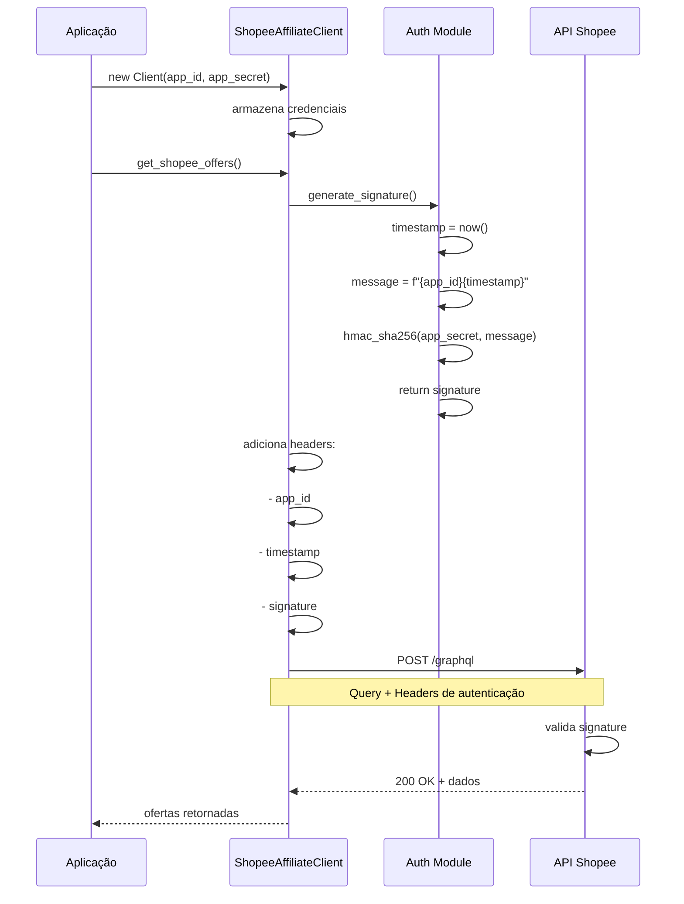
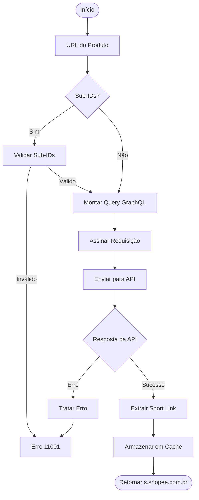
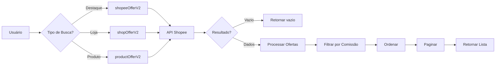
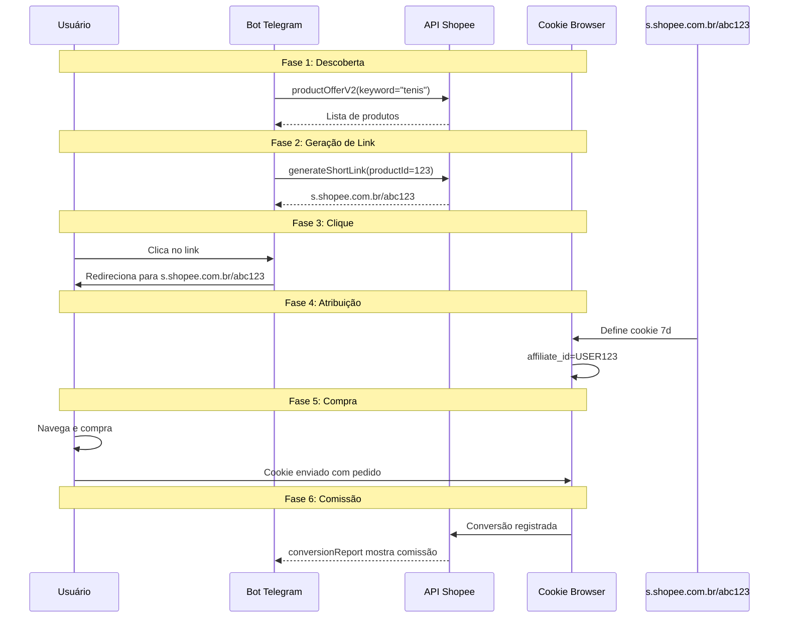
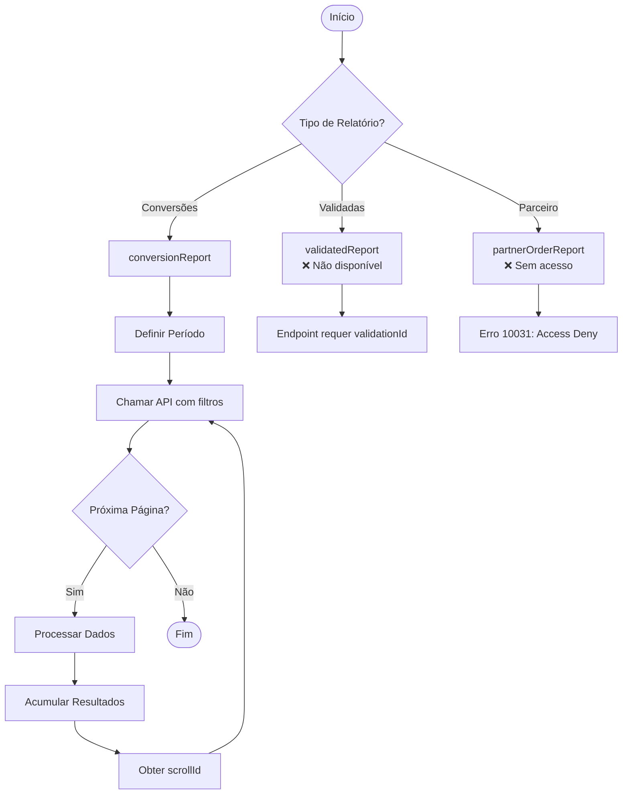
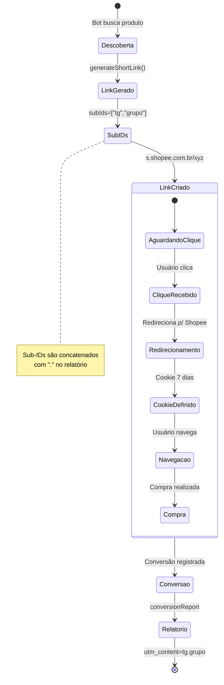
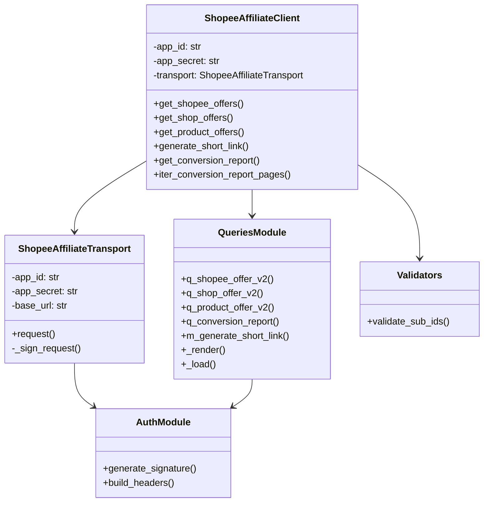
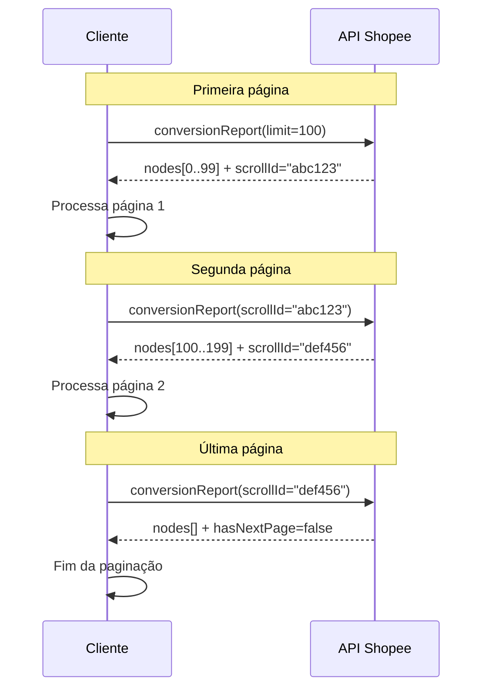
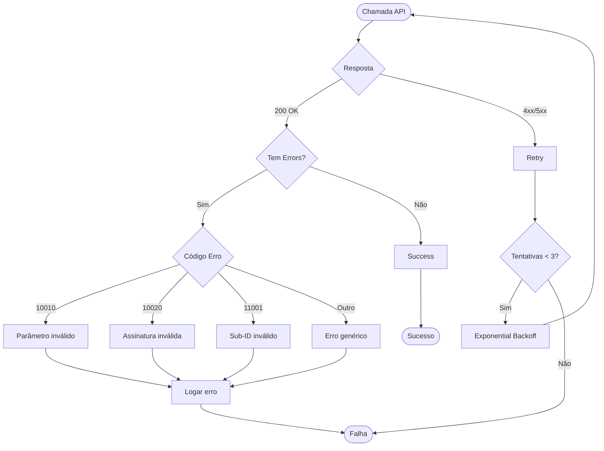
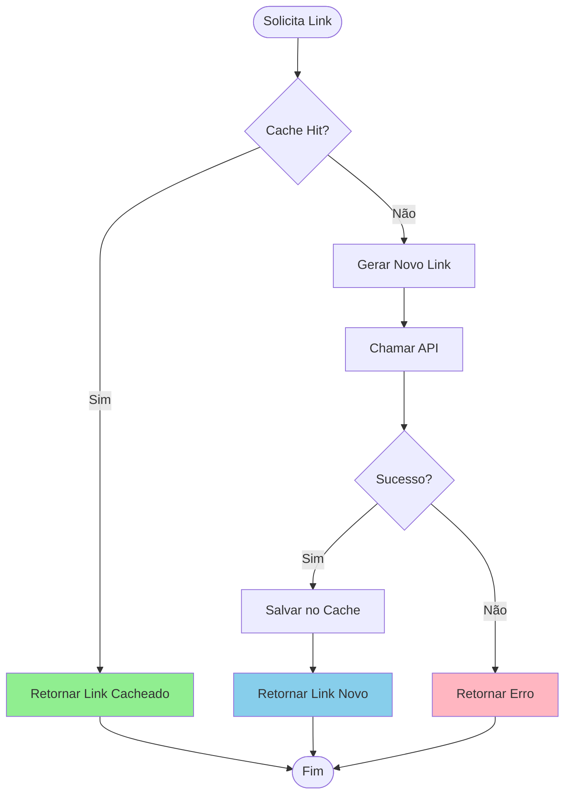

# Diagramas de Fluxo - API Shopee Affiliate

**Versão:** 0.1.0
**Data:** 2026-02-16

---

## Índice

1. [Fluxo de Autenticação](#fluxo-de-autenticação)
2. [Fluxo de Geração de Link](#fluxo-de-geração-de-link)
3. [Fluxo de Consulta de Ofertas](#fluxo-de-consulta-de-ofertas)
4. [Fluxo de Rastreamento de Comissões](#fluxo-de-rastreamento-de-comissões)
5. [Fluxo de Relatórios](#fluxo-de-relatórios)
6. [Arquitetura do Cliente](#arquitetura-do-cliente)

---

## Fluxo de Autenticação



---

## Fluxo de Geração de Link



---

## Fluxo de Consulta de Ofertas



---

## Fluxo de Rastreamento de Comissões



---

## Fluxo de Relatórios



---

## Fluxo de Rastreamento com Sub-IDs



---

## Arquitetura do Cliente



---

## Fluxo de Paginação com ScrollId



---

## Fluxo de Tratamento de Erros



---

## Ciclo de Vida do Link de Afiliado

```mermaid
timeline
    title Ciclo de Vida do Link de Afiliado
    section Descoberta
        Bot busca produto : productOfferV2("tenis")<br/>Retorna: Lista com comissão
    section Geração
        Bot gera link : generateShortLink(url, subIds)<br/>Retorna: s.shopee.com.br/abc123
    section Clique
        Usuário clica : Bot envia link<br/>Redirecionamento para Shopee
    section Atribuição
        Cookie depositado :affiliate_id definido<br/>Validade: 7 dias
    section Compra
        Usuário compra : Qualquer produto no período<br/>Registra conversão
    section Comissão
        Conversão registrada : conversionReport mostra<br/>utmc_content=sub_ids
```

---

## Integração com Bot Telegram

```mermaid
flowchart LR
    User[Usuário Telegram] --> Command[Comando /buscar]
    Command --> Bot[Bot Python]

    Bot --> Search[productOfferV2]
    Search --> Results[Lista de Produtos]

    Results --> Format[Formatar Mensagem]
    Format --> Link[generateShortLink<br/>subIds=["telegram"]]

    Link --> Send[Enviar para Usuário]
    Send --> User

    User --> Click[Clicar no Link]
    Click --> Track[Rastreamento Iniciado]
    Track --> Comm[Comissão Registrada]
```

---

## Fluxo de Cache de Links



---

**Última atualização:** 2026-02-16
